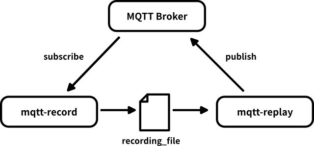

# mqtt-record-replay

Tools for recording MQTT topics and playing them back in real-time.




## Usage

Setup your `GOPATH` and/or `GOBIN` beforehand to be listed in your `PATH` environment variable to be able to call the resulting binary as any other application.

### Installation
Change to any directory you like and clone this repository with:
```shell
git clone https://github.com/yoggy/mqtt-record-replay.git
```

Then switch to to the cloned directroy and compile and install the two appliations to your `GOBIN`:
```shell
cd mqtt-record-replay
go install ./...
```


### Recording
Record any MQTT topics from an MQTT broker to an arbitrary file name.

- The connection to the broker needs to be given as a URL (tcp, ws and ssl "schemes" are supported).
- The topic can be any valid MQTT topic string, including MQTT wildcards

```shell
mqtt-record -b tcp://iot.eclipse.org:1883 -t "test/record/topic/#" -o record.mqtt
```

See the output of `mqtt-record -h` for details on the parameters.

 
### Replaying
A previously recorded file can be replayed in real-time by defining the file name and broker URL in the most simple case:

```shell
mqtt-replay -b tcp://iot.eclipse.org:1883 -i record.mqtt
```

This tool also provides the opportunity to start the replay some seconds into the recording and to stop at a certain offset time.
See the output of `mqtt-record -h` for details on the parameters.


During playback, some playback control (play/pause and skipping) is possible by doing simple key presses.

- Halt the playback with SIGINT (`Ctrl-C`):
  * Press the space bar to start playing again
  * Press right arrow key to skip 5 seconds forward
  * Restart from beginning with left arrow key
- (use SIGQUIT (`Ctrl+-\`) to stop the application or use SIGINT twice)


## Copyright and license
Copyright (c) 2018 yoggy
Copyright (c) 2021 Bendix Buchheister
Copyright (c) 2022 Jannik Beyerstedt

Released under the [MIT license](LICENSE.txt)
